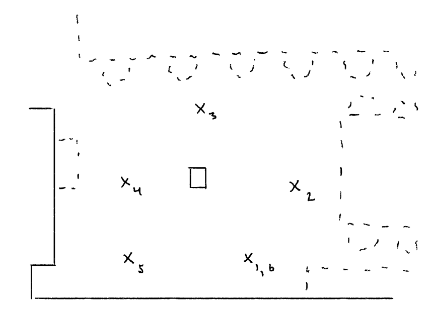
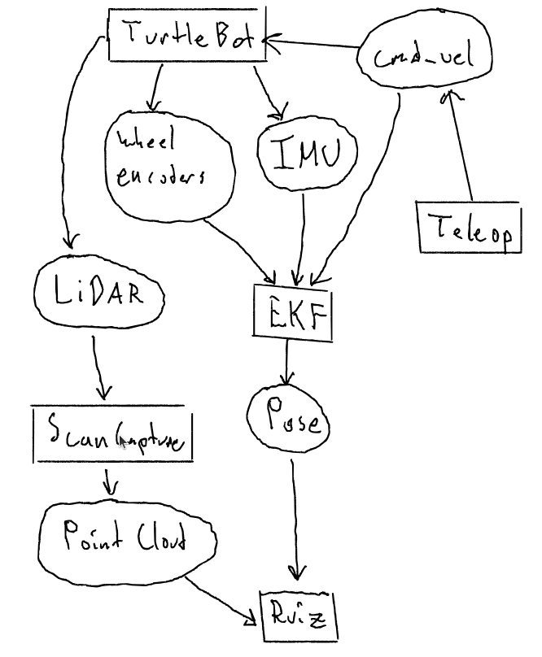
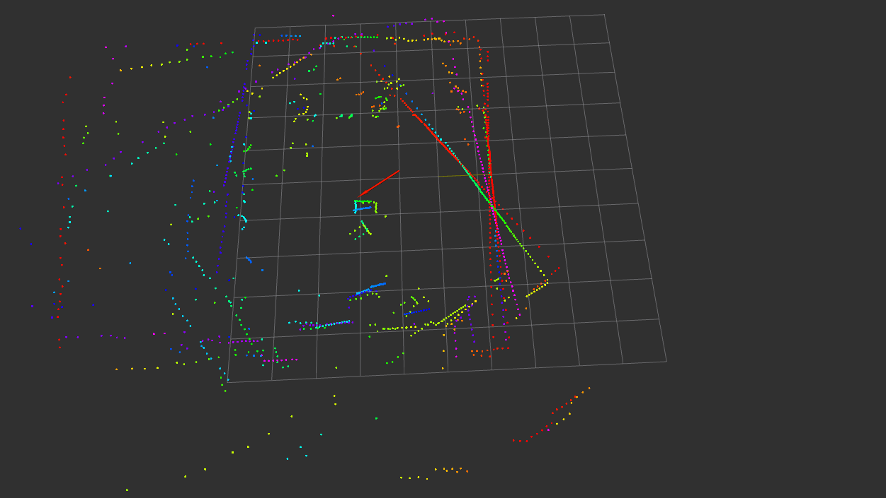
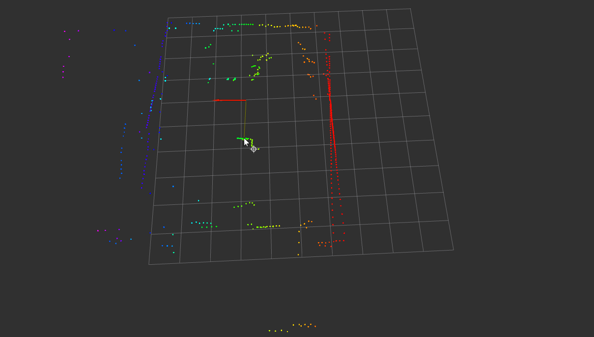
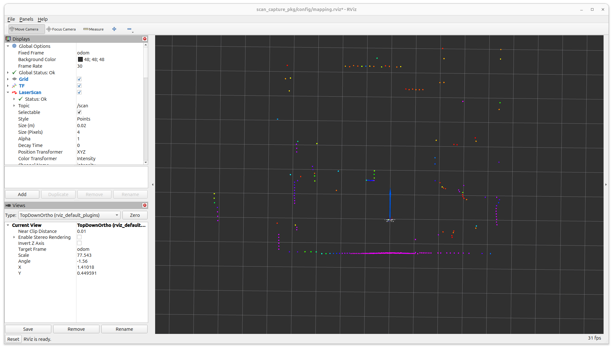
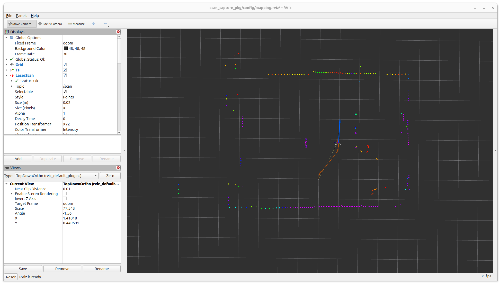
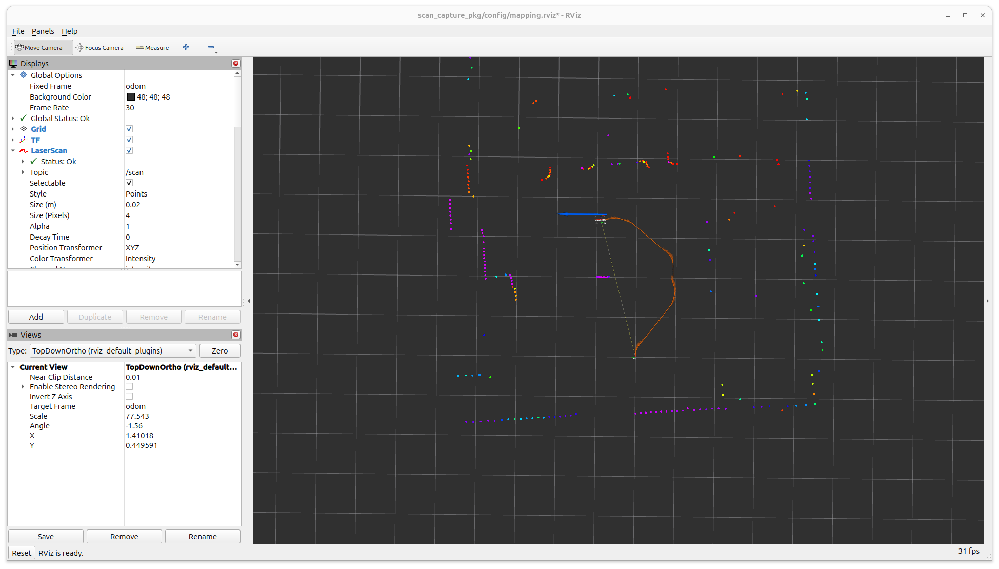
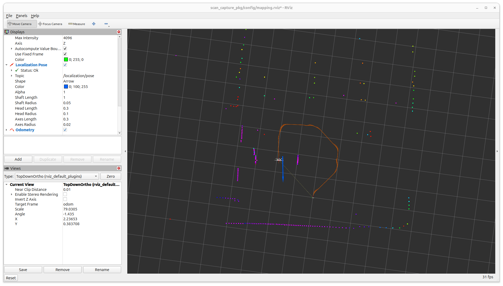
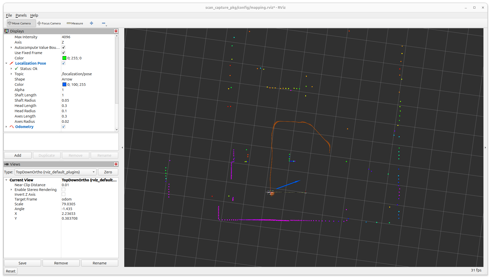
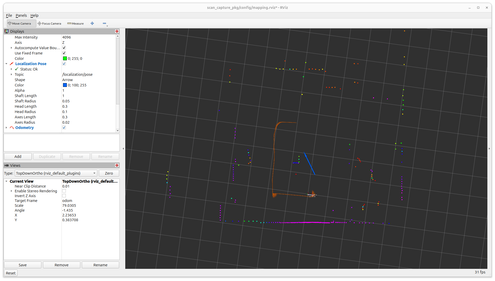

# Project 6: Naive Mapping by Waypoints

#### Ian Q. Mattson & Malcolm Benedict

## Introduction

Mapping is a key part of mobile robotics, and this exercise served as an introduction to it with the TurtleBots. To begin, a map of the environment was sketched, waypoints were selected, marked, and their location was recorded. Then, a map of the same environment was generated using the LiDAR on a TurtleBot, by recording a point cloud at each of the designated waypoints.

## 1. Navigation Strategy Summary
<div style="text-align: center;">

#### Environment Sketch

*Sketch of the floorplan of EERC 722. The waypoints are denoted by 'X', and a recycle bin has been added to the center of the room to serve as a second landmark.*
</div>

Our navigation strategy is to use the north wall and the recycle bin in the center of the room as landmarks. For points 1,5, and 6, the robot uses the wall as its landmark. For points 2,3, and 5, it uses the recycle bin. At every waypoint the robot's orientation is one of the four cardinal directions (N,W,S,E), with 0° corresponding to south. While only five points are required, a sixth point was added, which is identical to the first one, for loop closure purposes. A detailed discussing of the strategy can be found in the [`navigation_strategy.md`](./docs/navigation_strategy.md) document.


## 2. System Architecture
<div align="center">

#### Flow Graph

</div>

This project incorporated an Extended Kalman Filter from project 4. The parameters used are as follows:


```
       [[1, 0, -v*sin(ekf_x[2, 0])*delta_t, cos(ekf_x[2, 0])*delta_t, 0],
        [0, 1,  v*cos(ekf_x[2, 0])*delta_t, sin(ekf_x[2, 0])*delta_t, 0],
  F =   [0, 0, 1, 0, delta_t],
        [0, 0, 0, 1, 0],
        [0, 0, 0, 0, 1]]
```        

```
       [[v_left],
  z =   [v_right],
        [imu_a],
        [imu_omega]]
 ```

```
       [[0, 0, 0, 1, -L/2],
  H =   [0, 0, 0, 1, L/2],
        [0, 0, 0, 1/delta_t, 0],
        [0, 0, 0, 0, 1]]
``` 

The EKF used to filter the IMU and encoder data can take the variable covariance as a parameter matrix. If the IMU and encoders have been properly characterized, this data can be provided. Known LiDAR bias can be accounted for by simple subtraction and scaling. However, as discussed later, the intrinsic parameters of the LiDAR are likely a negligible source of error within the scope of this experiment.

## 3. Map Accuracy Results
<div align="center">

#### Composite Map From All Waypoints


#### Distance Accuracy Table 

| Waypoint | Landmark | Measured (m) | RViz (m) | Error (m) | Error (%) |
|----------|----------|--------------|----------|-----------|-----------|
| 1 | North wall | 1.370 | 1.368 | 0.002 | 0.146% |
| 2 | Recycle bin | 1.598 | 1.605 | 0.007 | 0.438% |
| 3 | Recycle bin | 1.444 | 1.454 | 0.010 | 0.693% |
| 4 | Recycle bin | 0.963 | 0.940 | 0.023 | 2.388% |
| 5 | North wall | 1.373 | 1.396 | 0.023 | 1.675% |
| 6 | North wall | 1.370 | 1.378 | 0.008 | 0.584% |
</div>

Overall, the distance measurements are remarkably good, with an average error of just 12mm and a max error of 23mm. However, as the Composite Map shows, there is significant drift in the later points in terms of orientation. This is because the pose is calculated from Kalman filtered IMU and `/cmd_vel` data. While the filter helps mitigate noise, error still accumulates, particularly in the orientation. The pilot aligned the robot to the prerecorded position, so the distance measurement error remains small. However, the TF used to localize the point clouds into the global frame was derived from the pose data, causing the to become misaligned over time.

<div align="center">

#### Measurement Example

</div>
The ground truth measurements were preformed with a laser rangefinder, accurate to 1mm. The point clouds were recorded from the TurtleBot's LiDAR, and the distances were measured with the Rviz measurement tool, as seen above.

<div align="center">

#### Waypoint One Point Cloud

</div>

The initial reading is quite good. The wall is a very good landmark and there is no accumulated localization error. The above figure shows the Rviz view as the data was being recorded.

<div align="center">

#### Waypoint Two Point Cloud

</div>

Much like Waypoint One, this Waypoint is still quite well localized in the composite map.

<div align="center">

#### Waypoint Three Point Cloud

</div>

Much like Waypoint One and Two, this Waypoint is still quite well localized in the composite map.


<div align="center">

#### Waypoint Four Point Cloud

</div>

Here the localization begins to break down, likely as a result of wheel slip during one of the turns. The North Wall has become clearly misaligned and there is significant ghosting.

<div align="center">

#### Waypoint Five Point Cloud

</div>

The localization error from Waypoint Four is still present. Given that this map is fairly well aligned with that of Waypoints Four and Six, it seems likely that a large portion of the error came from some single source between Three and Four, possibly wheel slip.

<div align="center">

#### Waypoint Six Point Cloud

</div>

From the loop closure point it is clear that a noticeable localization error has accumulated.

## 4. Discussion

Overall, each point cloud is remarkably accurate, that is to say that the distance readings to known landmarks are close to the ground truth. There is no bias that is visible via causal inspection. The primary source of error with regards to the LiDAR is more likely misalignment with floor markings during trials or initial mismeasurement.

However this does not necessarily mean that the resulting map is good. Due to poor localization, the point clouds captured later in the run are quite misaligned. This is a result of relying on IMU, encoder and command data to dead reckon the position. While there are multiple sources of data, and said data are filtered via Extended Kalman FIlter, there is still no sort of feedback to close the loop. As a result, error, particularly rotational error, tends to accumulate. 

Thus, the map is consistent, but poorly localized. Each measurement is good, the error is mostly coming from the combination. The main way to fix this would be to provide some sort of loop closure with a sensor that could measure orientation or even position directly. This would reduce the impact of the error accumulation. While a sensor such as a compass could theoretically fill this role, adding additional sensors is not actually needed. The LiDAR itself can be used help localize, while mapping. The obvious solution for improvement is to use SLAM, which should help limit some of the localization error, although it is difficult to remove entirely.


## 5. Usage Instructions

To use this package, first clone this repo into a ROS2 workspace:

```
$ mkdir -p ~/project_ws/src
$ cd ~/project_ws/src
$ git clone git@github.com:Robust-Autonomous-Systems-Laboratory/project6-waypoint-mapping-group4.git
```

Next, build and source the package:

```
$ cd ~/project_ws
$ colcon build
$ source install/setup.bash
```

#### <u>Important Note: </u>

If this system is running with live Turtlebot data, each terminal must set the ROS_DOMAIN_ID enviornment variable that corresponds to the Turtlebot's domain ID.  If not, remote Turtlebot topics will not be received by the nodes.

### How to launch your localization node

An EKF node from [project 4](https://github.com/Robust-Autonomous-Systems-Laboratory/proj4_group3) was imported to the  `scan_capture_pkg` and adjusted to publish a `PoseStamped` msg on the `/localization/pose` topic, in addition to the filter's Odom and Path messages.

To start the localization system, ensure the package is sourced and run the node with the following:

```
$ cd ~/project_ws
$ source install/setup.bash
$ ros2 run scan_capture_pkg ekf_node.py 
```

The node will remain idle until it receives Turtlebot topics `/imu`, `/joint_states`, and `/cmd_vel` from either the live robot or playback data from a bag file.

### How to run the scan capture system

To capture laser scan data for naive mapping applications, the CaptureScan service is leveraged to record information and convert LaserScan message data to a PointCloud2 message that forms the basis of the map.

Several terminals are required to run the scan capture system. All terminals require the workspace to be sourced (`source install/setup.bash`) and have a domain ID enviornment variable if using live Turtlebot data.

#### Terminal 1 - EKF node

The localization node descirbed in the previous subsection starts the extended kalman filter node for robot localization.  Ensure it is running and error-free before proceeding

#### Terminal 2 - Scan Capture Node

This is the main node and ROS2 service 'server' that advertises and processes CaptureScan service requests.

Navigate to the root of the git repositiory (~/project_ws/src/project6-waypoint-mapping-group4) and start the launch file. This is required to ensure the generated artifacts are saved in the proper [`data/`](./data/) directory.

```
$ cd ~/project_ws/src/project6-waypoint-mapping-group4
$ ros2 launch scan_capture_pkg scan_capture.launch.py
```

#### Terminal 3 - Keyboard Capture

While the robot is initialized and the previous nodes are running, the keyboard capture node will trigger the CaptureScan service and associate waypoints and export generated data.  Run via:

```
$ ros2 run scan_capture_pkg keyboard_capture.py
```
and enter the corresponding waypoint ID to save artifacts at each point.  Press `q` to quit the node.

### How to visualize the captured map

To visualize the captured map, first open three terminal windows and, in each one, navigate to the root of the workspace and source.

```
$ cd ~/project_ws/
$ source install/setup.bash
```
#### Terminal 1 - Rviz2

Rviz is used to actually visualize the data. Open it with

```
$ rviz2
```
Within Rviz, set the fixed frame to `base_scan` (This will be changed shortly) Add the following topics to display: `/scan_capture/pointcloud/PointCloud2` and `/localization/pose/Pose`. This will display the robot's pose and the point cloud together. 

#### Terminal 2 - Localizer Node
Unfortunately, automatic frame conversion does not seem to to work for the point cloud. To address this, `localizer.py` implements a very simple transform based on the pose. Run it with the following:
```
$ ros2 run scan_capture_pkg transformer.py 
```
#### Terminal 3 - ROS Bag Playback
Lastly, play the ROS bag with the following command:
```
$ ros2 bag play data/mapping_run --clock
```

Once the first point cloud appears in Rviz, pause the playback in Terminal 3 with the space bar. In Rviz, change the fixed frame from `base_scan` to `odom`. Resume playback by pressing space in Terminal 3. This step is needed because the first point cloud was generated before any Pose data was. The transformer needs pose data to generate a TF, and the point cloud cannot be plotted in `odom` without a TF.